# 番茄叶片救治决策支持系统

基于多智能体协作与视觉-语言融合的农业病害诊断系统。系统接收番茄叶片病害的图像，经过视觉分析、知识检索与多轮专家智能体协作推理，输出结构化诊断报告与救治方案，并且会对最后的输出的结论进行置信度打分。


## 界面预览

### 多轮会诊流程可视化

系统实时渲染各智能体的激活状态与信息流向，可直观追踪每一轮诊断推理的完整过程。

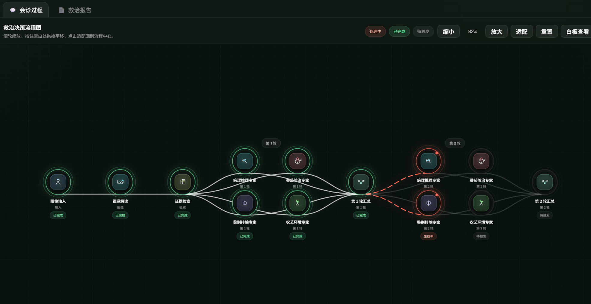

### 诊断报告输出

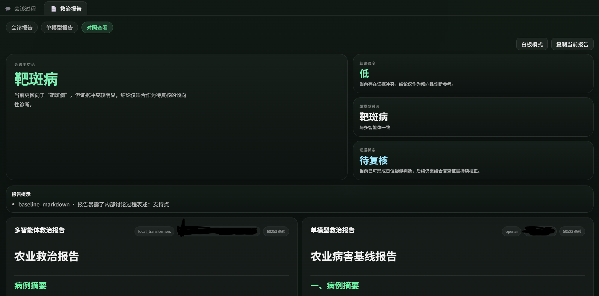

### 运行记录

所有历史诊断均持久化存储，可随时查阅完整运行轨迹与最终结论。

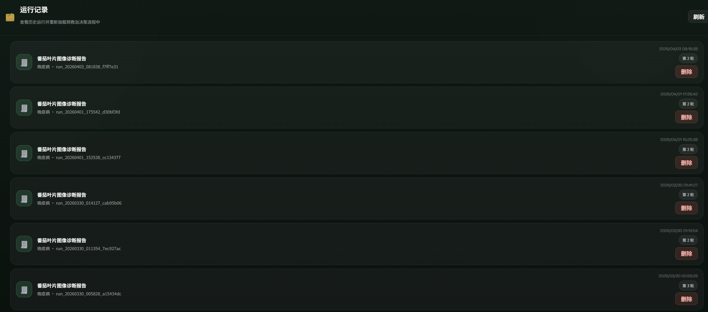

### 病例库

系统自动将高质量诊断归档为可复用案例，支持已验证与待审核分层管理。

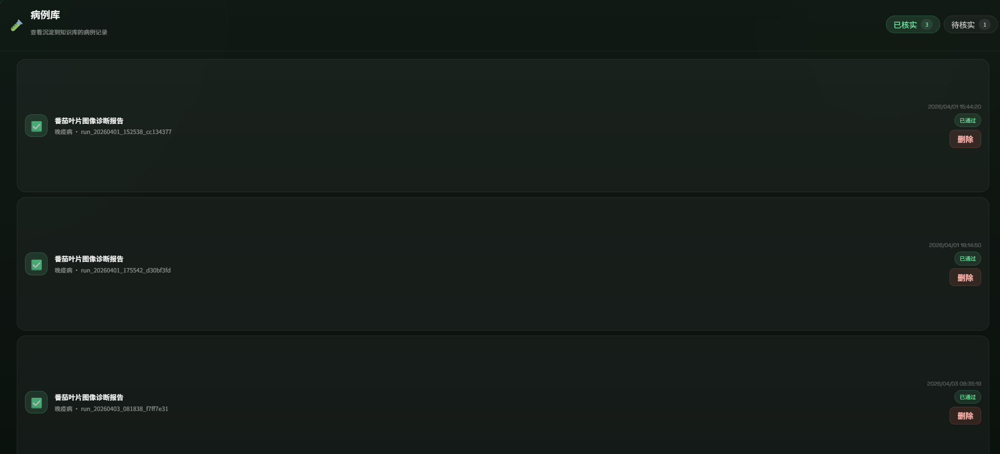

### 知识库管理

支持上传 `.txt` / `.md` 格式的防治文档，构建领域专属检索知识库。

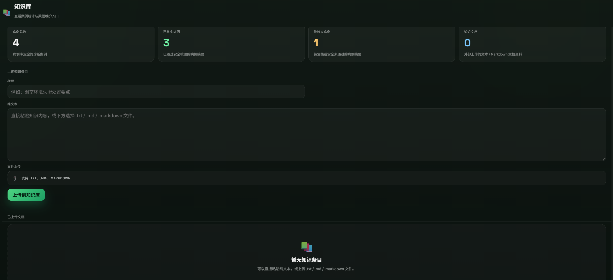


## 系统架构总览

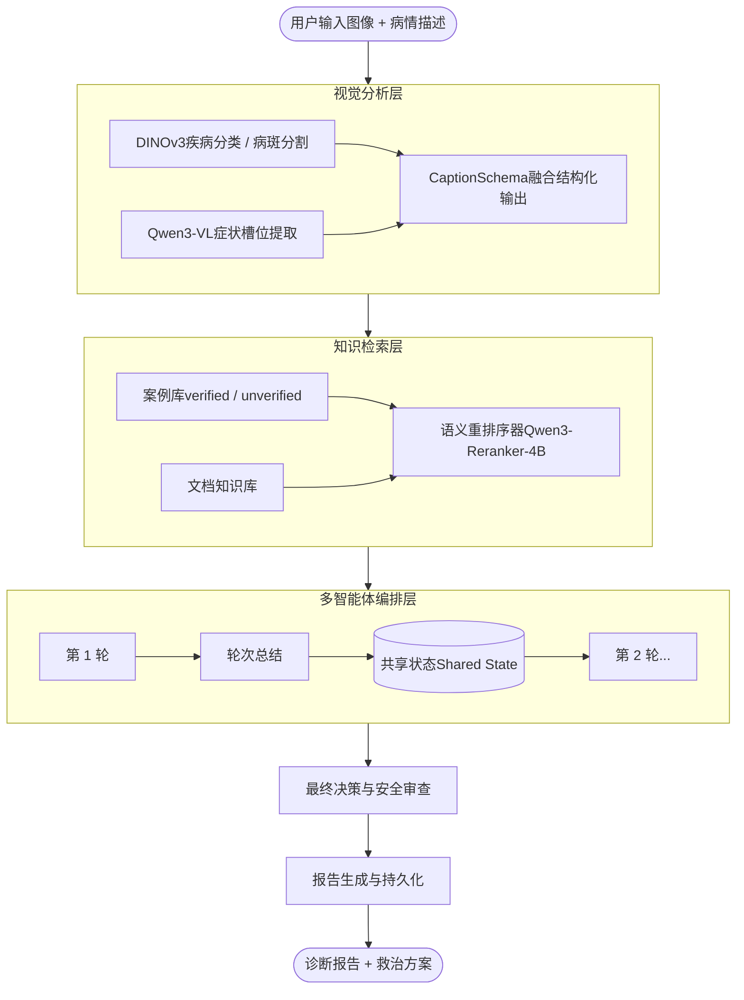


## 多智能体协作机制

系统核心由四个职责互补的专家智能体构成，每轮分两个层次并行执行，彼此之间不直接通信，通过共享状态（Shared State）进行信息汇聚与冲突解消。

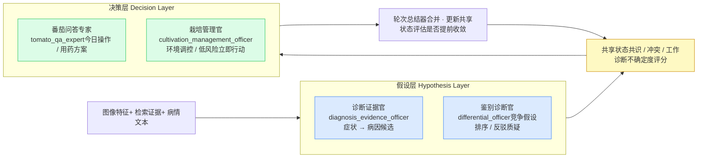

### 智能体职责边界

| 智能体 | 核心职责 | 禁止越界 |
|--------|----------|----------|
| **诊断证据官** | 将图像症状转译为病理假设，给出 1-3 个候选病因及置信度 | 不得给出治疗方案或环境处方 |
| **鉴别诊断官** | 对候选假设进行逻辑审计，提出反驳证据，排序竞争诊断 | 不得构建初始假设或涉及治疗 |
| **番茄问答专家** | 给出即时可执行的用药与管控操作，设定 48h 监测节点 | 不得进行诊断推理或环境管理 |
| **栽培管理官** | 独立于诊断，给出通风、湿度、隔离等低风险环境调控方案 | 不得选择杀菌剂或重复描述症状 |


## 多轮推理与收敛控制

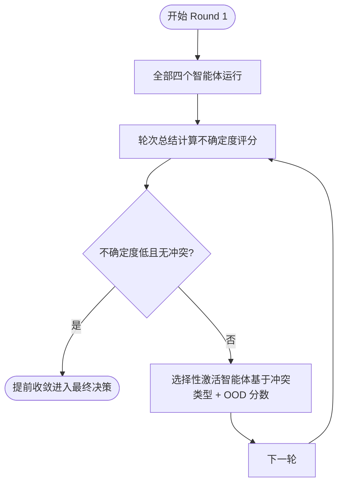

- **不确定度评分**（0-1）由置信度差值与图像分布外（OOD）评分联合计算
- 轮次越多，激活的智能体越精准，聚焦在尚未收敛的分歧点上
- 默认执行 2-3 轮，高确信案例可在第 1 轮后即停止

## 视觉分析层

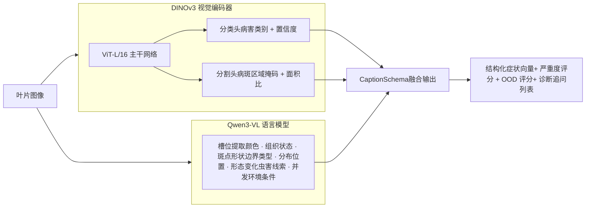


## 知识检索层

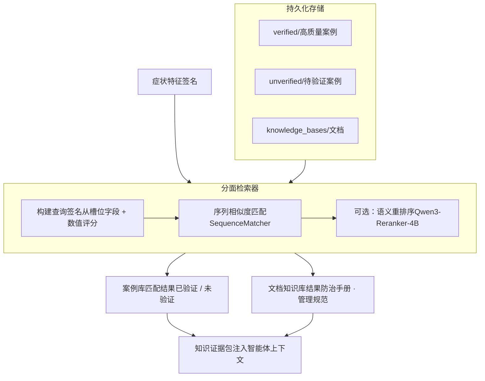

案例在每次诊断完成后自动归档。若通过安全审查且有文献引用支撑，则写入 `verified` 库；否则保存至 `unverified` 库供人工复核。


## 最终决策与安全审查

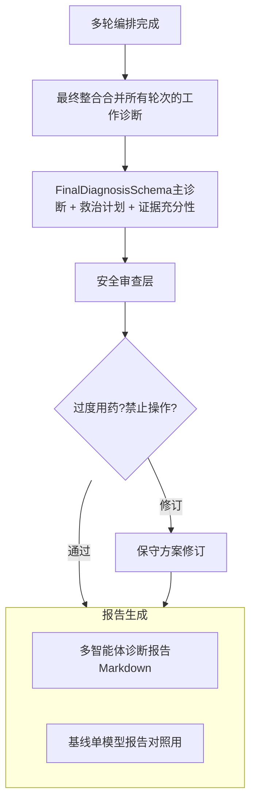


## 快速开始

**1. 安装依赖**

```bash
pip install -r requirements.txt
```

**2. 配置环境变量**

复制 `.env.example` 为 `.env`，填写 LLM 接入地址、API Key 与本地模型路径。

```env
# 多智能体 LLM 后端（local_transformers / openai / ollama）
MULTIAGENT_LLM=openai
MULTIAGENT_OPENAI_BASE_URL=https://api.openai.com/v1
MULTIAGENT_OPENAI_API_KEY=sk-...
MULTIAGENT_OPENAI_MODEL=gpt-4o

# 基线对照模型
BASELINE_OPENAI_MODEL=gpt-4o-mini

# 本地视觉模型（可选）
ENABLE_LOCAL_DINOV3=false
ENABLE_LOCAL_QWEN3_VL=false

# 编排参数
N_ROUNDS=2
```

**3. 启动服务**

```bash
uvicorn app.api.main:app --host 0.0.0.0 --port 8000
```

访问 `http://localhost:8000` 打开 Web 界面，或直接调用 REST API。

---

## 项目目录结构

```
├── app/
│   ├── api/                    # FastAPI 路由与请求模型
│   ├── core/
│   │   ├── agents/             # 四个专家智能体定义、编排器、协议 Schema
│   │   ├── caption/            # 视觉分析（DINOv3 + Qwen3-VL + 融合 Schema）
│   │   ├── pipeline/           # 诊断流水线入口（同步 / 流式）
│   │   ├── retrieval/          # 案例检索、知识库、重排序
│   │   ├── storage/            # 运行记录、案例库持久化
│   │   ├── vision/             # DINOv3 推理服务
│   │   ├── config.py           # 全局配置（环境变量映射）
│   │   └── llm_clients.py      # 多后端 LLM 客户端与路由
│   └── ui/                     # 前端模板与静态资源
├── knowledge_bases/
│   ├── verified/               # 已验证病害案例（JSONL）
│   └── unverified/             # 待审核案例（JSONL）
├── case_library/               # 运行时自动归档的案例
├── runs/                       # 每次诊断的完整运行轨迹
└── .env.example                # 环境变量配置模板
```

## 致谢
本项目得益于以下优秀开源项目的支持，特此致谢：

- [Dinov3](https://github.com/facebookresearch/dinov3)：自监督视觉 Transformer 模型  